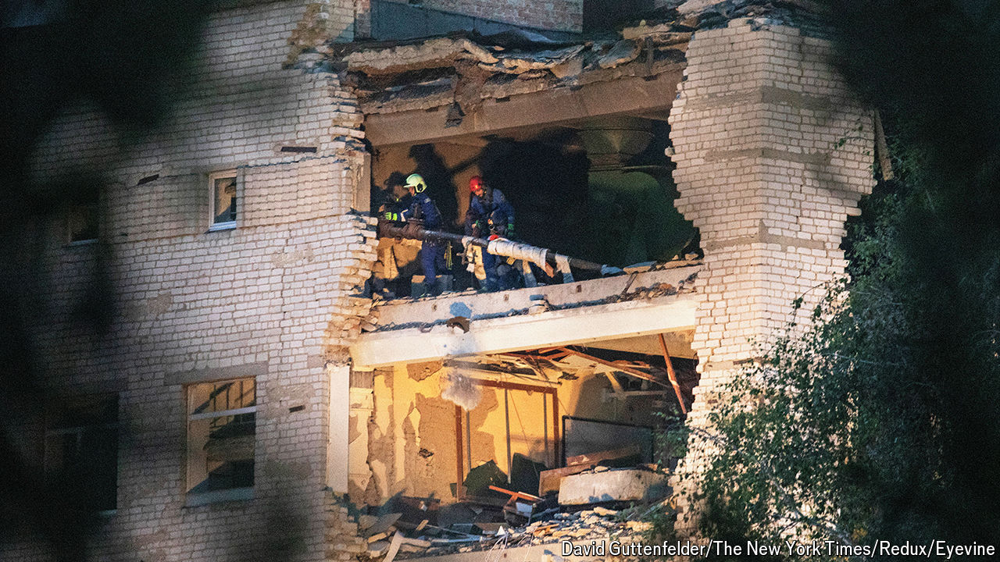

###### The world this week

# Politics 

#####  

 

> Sep 5th 2024 

At least 50 people were killed when  missiles struck a military college in Poltava, a town in central . Volodymyr Zelensky promised that “the Russian scum will definitely be held accountable” for the attack, and again pleaded for more air-defence systems from the West. Russia paid no notice, attacking Ukraine again and killing seven people in Lviv, a city close to the Polish border that has been relatively unscathed in the two-year conflict. Mr Zelensky overhauled the top echelons of his government, ousting Dmytro Kuleba as foreign minister. Earlier, the president sacked the head of the air force after an F-16 crashed, killing a pilot. 

