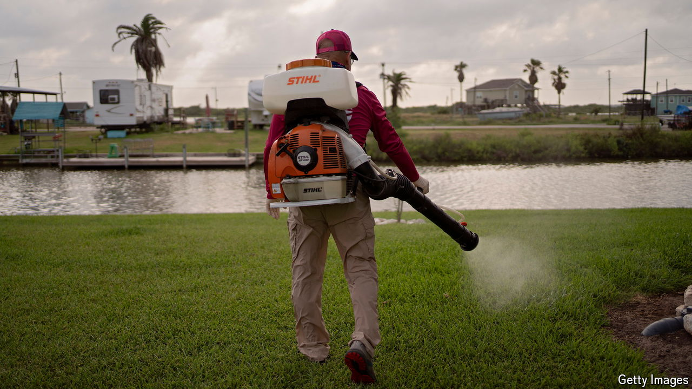

###### Nile-ism

# America’s endless summers are good for mosquitoes, too 

##### Outbreaks of EEE and West Nile virus have health officials on the alert 

 

> Sep 5th 2024 

HIGH SCHOOLS in Plymouth, Massachusetts have moved kick-off times at American football games to the afternoon from the evening. Everyone has to be off the field by dusk because of worries about a rare but often deadly illness, carried by mosquitoes: Eastern equine encephalitis (EEE), also called Triple E. Two people in the state have been infected. About 30% of people who develop EEE die. 

