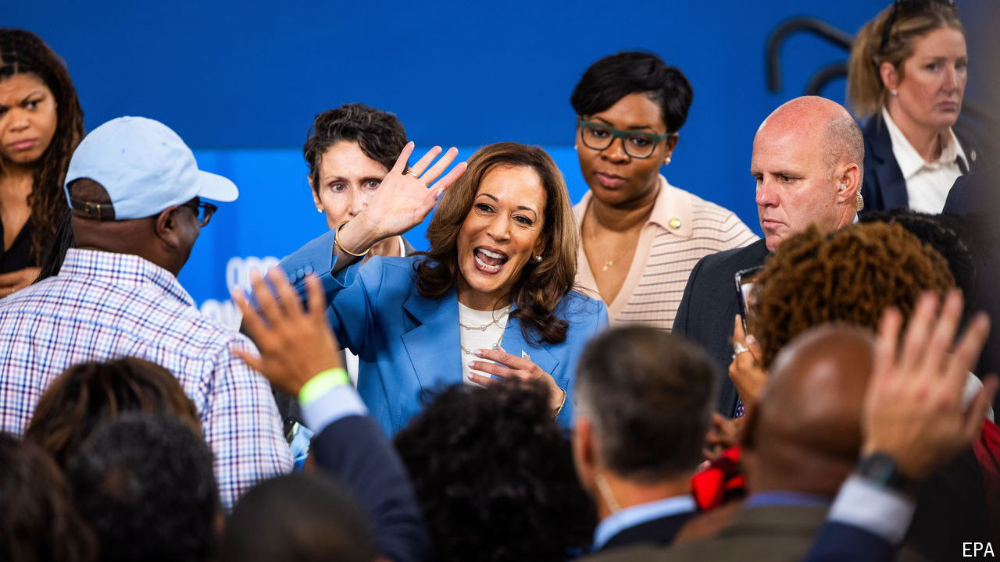

###### Swing states

# The Harris campaign hopes North Carolina will finally deliver 

##### Democrats reliably win statewide in local races, but fail in presidential votes. Will this time be different? 

 

> Sep 5th 2024 

DAVID JOHNSON fears his neighbour is a socialist. As a retiree he volunteers with his local Republican Party in Johnston County, a patch of North Carolina where pristine suburban streets yield to rambling country roads. The neighbour in question has put up a Black Lives Matter sign and Mr Johnson says she has accused him of being a white supremacist, which he denies. “She’s from Delaware,” he says. “Make of that what you will.”

