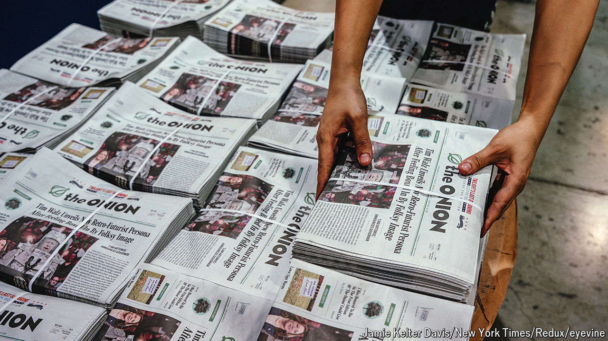

###### Back in black

# The Onion’s cutting edge: paper 

##### A new era dawns for America’s self-declared finest news source 

 

> Sep 2nd 2024 

Facing a difficult media environment, the, a satirical news organisation based in Chicago, announced in August that it was entering the subscription household-supplies business. In the glory days of media, writers could simply upload stories to a website and watch as eyeballs and advertising dollars flooded in. These days that is not enough, and the  has identified a potentially lucrative new source of revenue: regular deliveries of multipurpose layered cellulose fibres.

