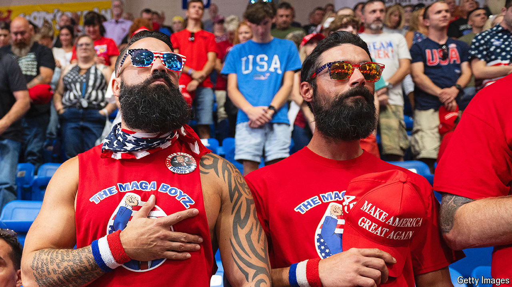

###### “Comrade Kamala”

# The Trump campaign fires a barrage of negative advertisements 

##### It could well work 

 

> Sep 4th 2024 

The presidential race has been  over the past two months, but a Donald Trump rally is still a Donald Trump rally. Thousands of supporters flocked to see him at a recent one in southwest Pennsylvania. As usual, vendors sold a variety of ever-evolving merchandise to satisfy all sorts of . (“If you’re not wearing a Trump hat, you might get mistaken for a Democrat,” one winking seller warned.) A breakdancer with a Trump mask performed for those standing in a line that stretched around a corner and up a hill. Attendees either mocked or ignored the handful of anti-Trump protesters outside. And Mr Trump was very much himself, bragging to delighted fans about how he had mastered “the weave”. He explained: “I’ll talk about like nine different things, and they all come back brilliantly together, and it’s like, friends of mine that are, like, English professors, they say, ‘It’s the most brilliant thing I’ve ever seen.’”

