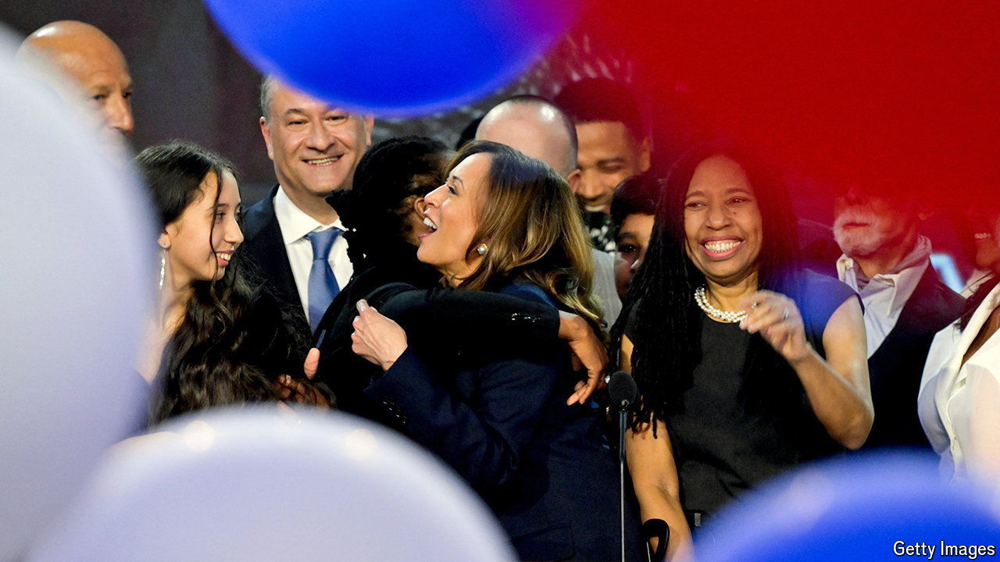

###### Campaign calculus

# Where is Kamala Harris’s convention bounce? 

##### And what its absence means for election forecasting 

 

> Sep 5th 2024 

National conventions are among the biggest spectacles of the presidential campaign. What was once a formal exercise to adopt a policy platform and nominate candidates is now a political variety show. Tightly choreographed, each party performs an all-singing, all-dancing televised audition to the nation, culminating in a curtain call and balloon drop. While this might look out of place in an era of political cynicism, millions of voters watch and reward the garish performances in opinion polls. After Bill Clinton, then governor of Arkansas, took to the stage in 1992, for example, voters were so impressed that his poll numbers leapt eight percentage points, putting him on course for victory.

