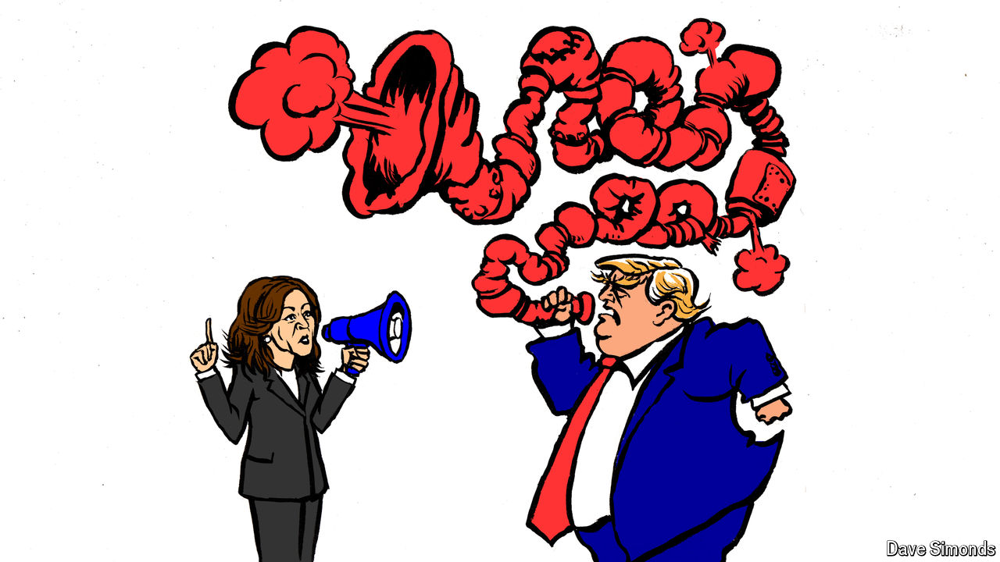

###### Lexington

# Why Kamala Harris has the advantage in debating Donald Trump 

##### She’s better at it 

 

> Sep 5th 2024 

“All of the things that we’ve done, nobody’s ever, never seen anything like, even from a medical standpoint. Right to try, where we can try space age materials instead of going to Asia or going to Europe and trying to get when you’re terminally ill. Now, you can go and you can get something. You sign a document.” Thus spake Donald Trump during his debate with President Joe Biden in June. Sift a bit, and maybe consult Google, and you can extract the meaning from the heap of words, shovelled up as part of his closing argument. The debate, a disaster for Mr Biden, may yet also prove one for Mr Trump, who did well that evening only because his opponent did worse.

