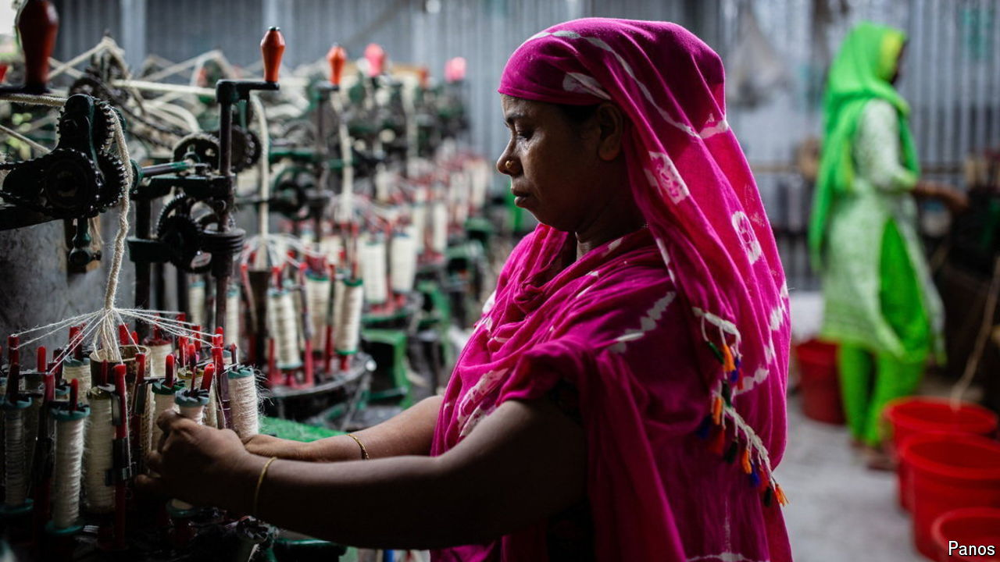

###### India v Bangladesh

# Can India’s garments industry benefit from Bangladesh’s turmoil? 

##### Despite the disruption, Bangladesh remains far ahead 

 

> Sep 12th 2024 

Asia’s rise has been stitched together by the textile industry. Across the continent, the production of t-shirts and trousers for the global market has drawn millions from fields to factories. No country exemplifies the power of this process more than Bangladesh. Since building its first export-orientated apparel factory in 1978, a joint venture with a South Korean firm, Bangladesh has turned its economy into a clothes-exporting powerhouse. The sector employs some 4m people, mostly women, and contributes 10% of the country’s GDP. Last year Bangladesh shipped $54bn-worth of garments, second only to China. 

