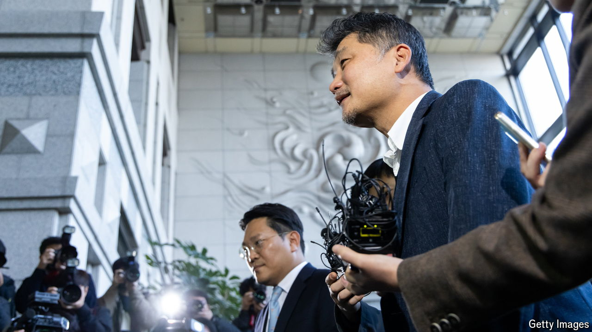

###### Corporate dynasties

# Kim Beom-su, the billionaire founder of Kakao, faces trial 

##### But will the tech entrepreneur be seen as “too big to jail”? 

 

> Sep 12th 2024 

KIM BEOM-SU sat expressionless as he faced the prosecutors in court. The 58-year-old founder and chairman of Kakao, a tech company, once reigned as the richest man in South Korea. His downfall began last year with a spat with HYBE, an entertainment giant that manages the boyband BTS, over a potential acquisition of SM Entertainment, another K-pop firm. In July, prosecutors accused Mr Kim and his executives of stock manipulation, claiming they had inflated SM Entertainment’s stock price by purchasing 240bn won ($180m at the time) in shares over 553 transactions to block HYBE’s takeover. On the first day of his trial on September 11th, Mr Kim’s lawyer reiterated that the purchases were “legitimate”. Kakao has said Mr Kim did not order or tolerate any illegal activity.

