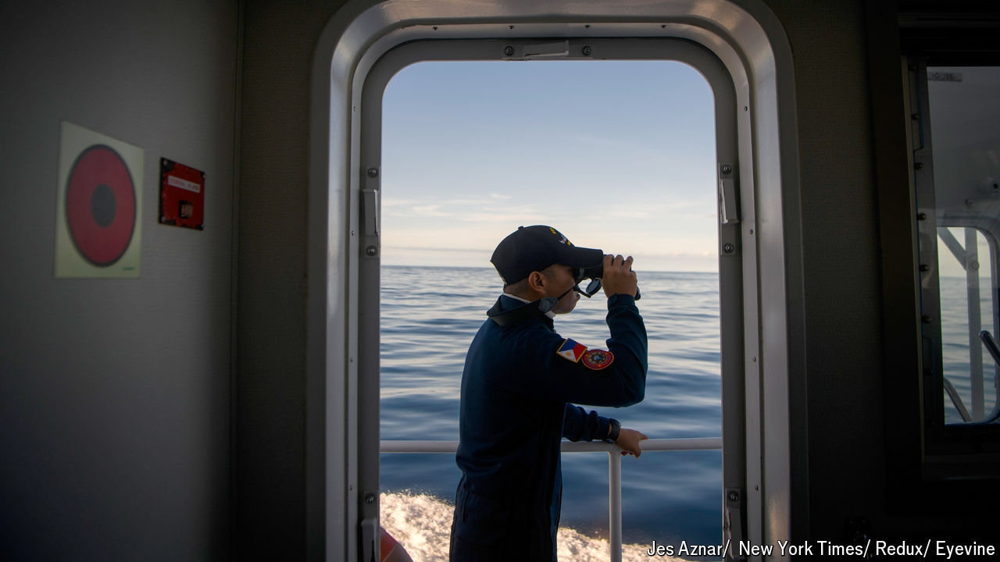

###### Superpower tensions in Asia

# The scary new map of the South China Sea 

##### Fresh fights over reefs and shoals test America’s credibility 

 

> Sep 10th 2024 

On August 31st a Chinese cutter rammed the largest patrol ship of the Philippine coastguard, punching a hole in its side. It was the latest attempt by China to force the  to leave Sabina Shoal, where it has been stationed since April. No one was injured. But the incident is part of an emerging new pattern of escalation and confrontation in the South China Sea, particularly around the . According to one account, Wang Yi, China’s top diplomat, warned Jake Sullivan, America’s national security adviser, that China would not accept a Philippine presence at Sabina, during their meeting near Beijing in August. The evidence points to a novel phase in the struggle for the . Whether China and America can safely contain the nerve-shredding contest is far from clear.

