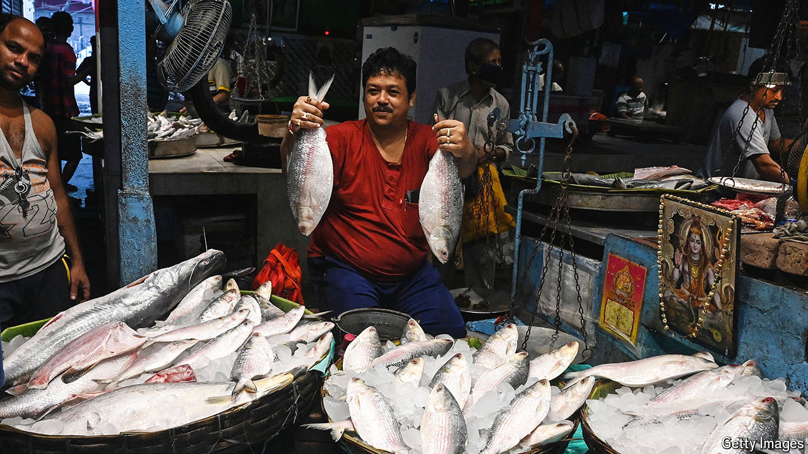

###### Machh ado about nothing

# What ilish, a fish, says about India-Bangladesh relations 

##### It is falling to pisces 

 

> Sep 12th 2024 

ILISH, SAY Bengalis, is delish. A bony freshwater fish, it is to the people of Bangladesh (where it is the official national fish) and the Indian state of West Bengal (which designates it the state fish) what salmon is to Norwegians and fish and chips is to Brits: not just a staple of their diet but an integral part of their identity. It is also a good proxy for the state of India-Bangladesh relations. 

