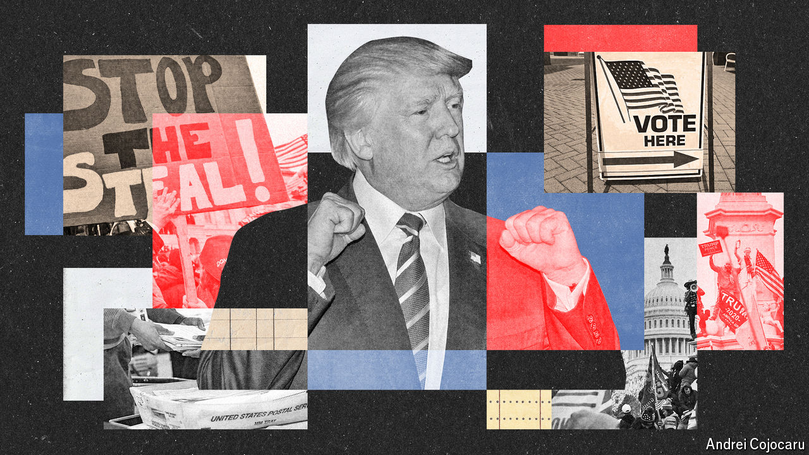

###### A foregone confusion

# What will happen if America’s election result is contested? 

##### The system is now stronger, but so is public mistrust of it 

 

> Sep 12th 2024 

GABRIEL STERLING is preparing for trouble: “Do we have concerns? Yes. Do we have backup plans? Sure. I don’t want to get too deep into them, because I don’t want people to have backup plans to our backup plans.”

