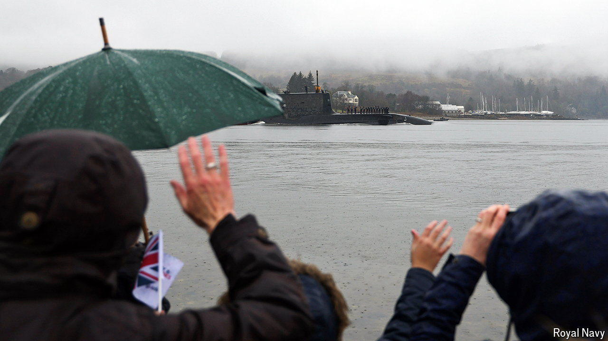

###### In deep trouble

# Britain’s submarines are at sea for too long—or not at all 

##### No sunlight or fresh food for months 

 

> Sep 9th 2024 

IN THE final days of August one of Britain’s four nuclear-armed Vanguard-class submarines—the government will not say which—limped back into the Scottish port of Faslane. Weary submariners, deprived of sunlight and fresh air for nearly six months, lay slumped against the conning tower. The hull was encrusted with marine growth. John Healey, Britain’s defence secretary, watching on, hailed the sailors’ “extraordinary sacrifices”. Yet such long patrols are also emblematic of a crisis in Britain’s submarine force. 

