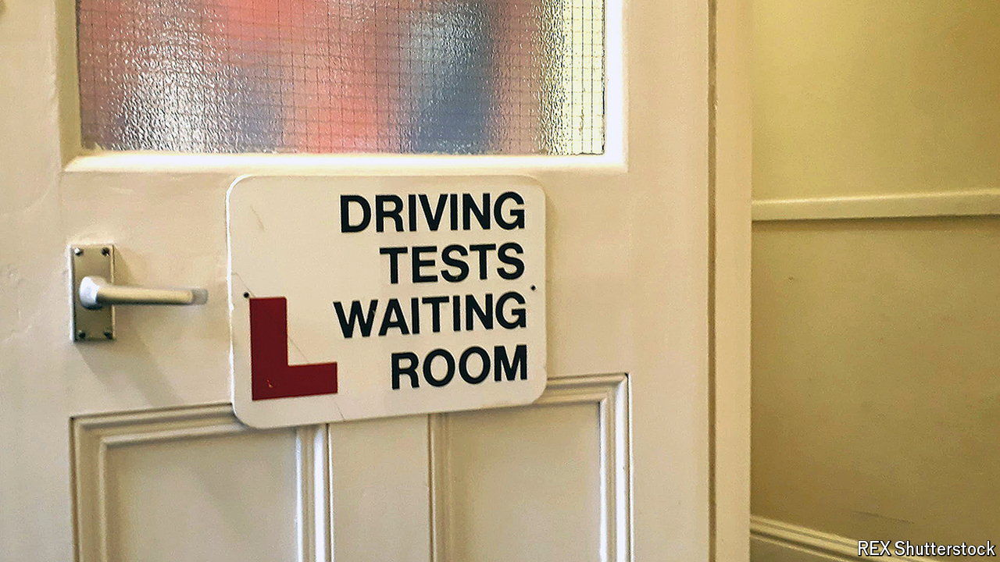

###### Driven up the wall

# Finding a driving test in Britain is painful, slow and expensive 

##### Unless the government steps up, it will take nearly five more years to clear the backlog 

 

> Sep 12th 2024 

All sorts of things were disrupted by the covid-19 pandemic: supplies of toilet roll and  ran scarce, flights were left near-empty. Most industries long ago returned to something like normality. The Driver and Vehicle Standards Agency (DVSA), which awards driving licences, is still reeling. 

