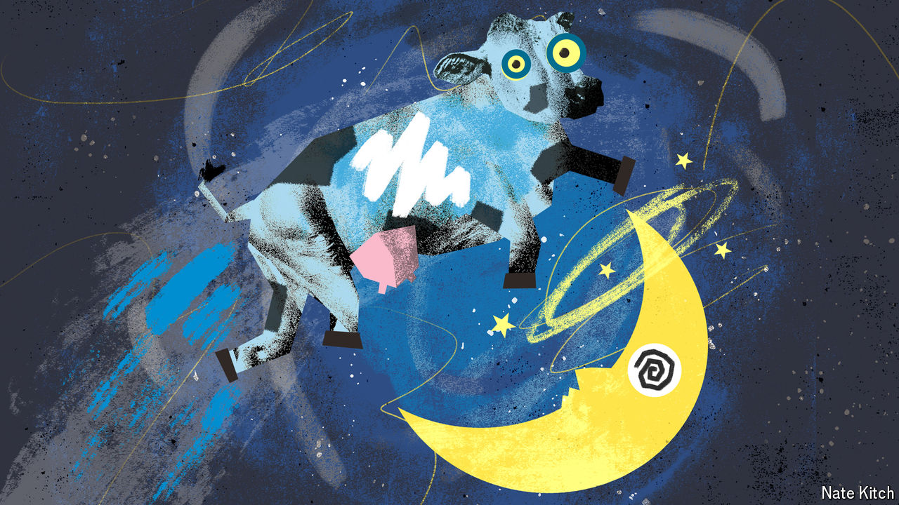

###### Bagehot

# Loons and the Tory leadership battle in Britain 

##### Who will speak for the Great British loon? 

 

> Sep 11th 2024 

The phrase “swivel-eyed loon” holds a special place in British politics. First uttered by an ally of David Cameron in 2013 to dismiss Conservative Party members unhappy with the unsound direction of his government, it swiftly entered Westminster’s vernacular. What started out as an insult soon became a badge of honour. “I am a lifelong Tory, and would be happy to wear a badge ‘Proud to be a Swivel-eyed Loon’,” wrote one correspondent to the . A compendium of such letters was titled appropriately: “The lunatics have taken over the asylum.” 

