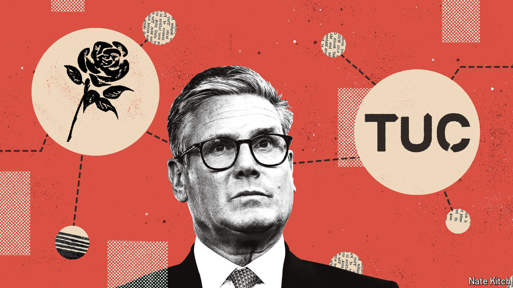

###### Brotherly love

# The harmony between Labour and Britain’s trade unions 

##### They agree on the labour market above all 

 

> Sep 10th 2024 

SIR TONY BLAIR, a former Labour prime minister, had a joke about critics on the party’s left flank. “An old colleague of mine said: ‘Come on Tony, now we’ve won again, can’t we drop all this New Labour and do what we believe in?’ I said: ‘It’s worse than you think. I really do believe in it.’” 

