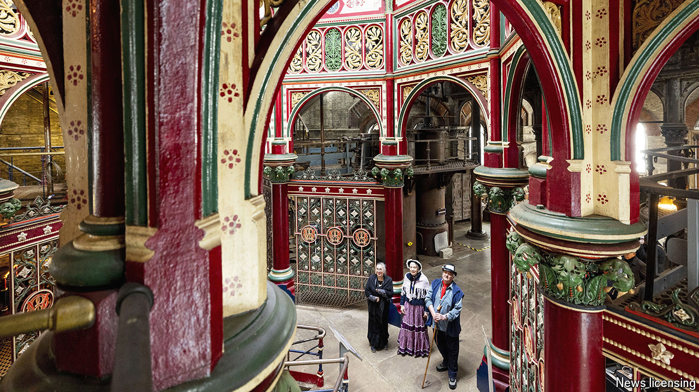

###### Keeping the juices flowing

# Volunteering has big benefits for the elderly 

##### But those Britons who would most benefit are least likely to do it 

 

> Sep 12th 2024 

THE CROSSNESS Pumping Station is not what you’d expect of a sewage works. With its spiral staircases, colourful tiling and intricate cast-iron latticing, it is a monument to the brilliance of Victorian engineering. Built in 1865 under the direction of Joseph Bazalgette, its four giant, steam-powered pumps (Prince Consort, Victoria, Albert Edward and Alexandra) were the beating heart of a system that eradicated cholera in London and established a model for urban sanitation. 

