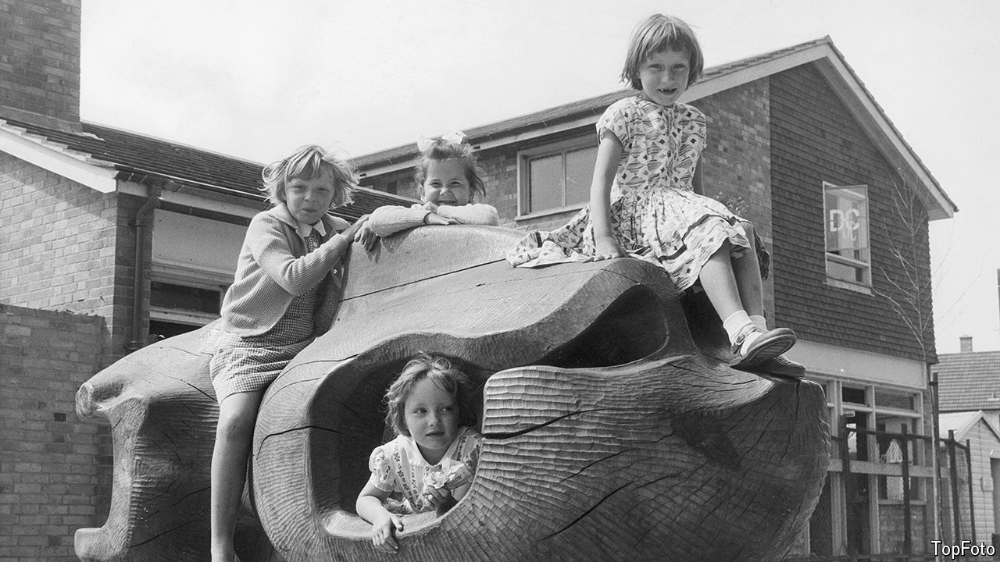

###### Urban planning

# Why have Britain’s new towns become fashionable again? 

##### The politics of social class is one reason 

 

> Sep 12th 2024 

Some governments have precious places—towns and villages that express their vision of Britain, that are filled with the sort of people who voted for them. For Boris Johnson’s governments, the place was Teesside, a Brexity part of north-east England. David Cameron haunted factories around Derby, a city in the East Midlands, in order to show that he understood ordinary people. But few were fooled: Lord Cameron will always be associated with the rich, untroubled town of Chipping Norton in the Cotswolds. 

