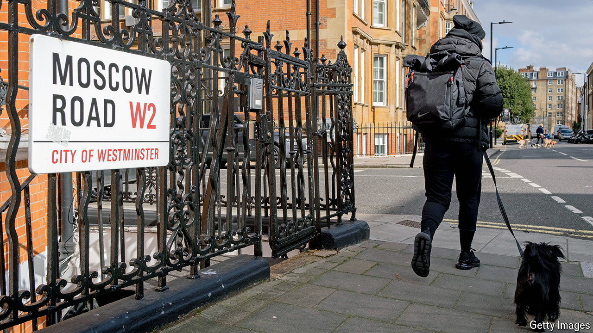

###### Laundry list

# Will Labour be better at tackling dirty money than the Tories? 

##### Two challenges stand out. Both could be dealt with quickly 

 

> Sep 12th 2024 

IN 2015 DAVID Cameron called time on those who saw London as “a place to stash your dodgy cash”. A year later the then prime minister hosted an international anti-corruption summit, at which he could tout Britain’s new public register of company owners, the first in a G20 country. This was a “high watermark” in Britain’s efforts to fight dirty money, reckons Robert Barrington, a corruption expert at Sussex University. 

