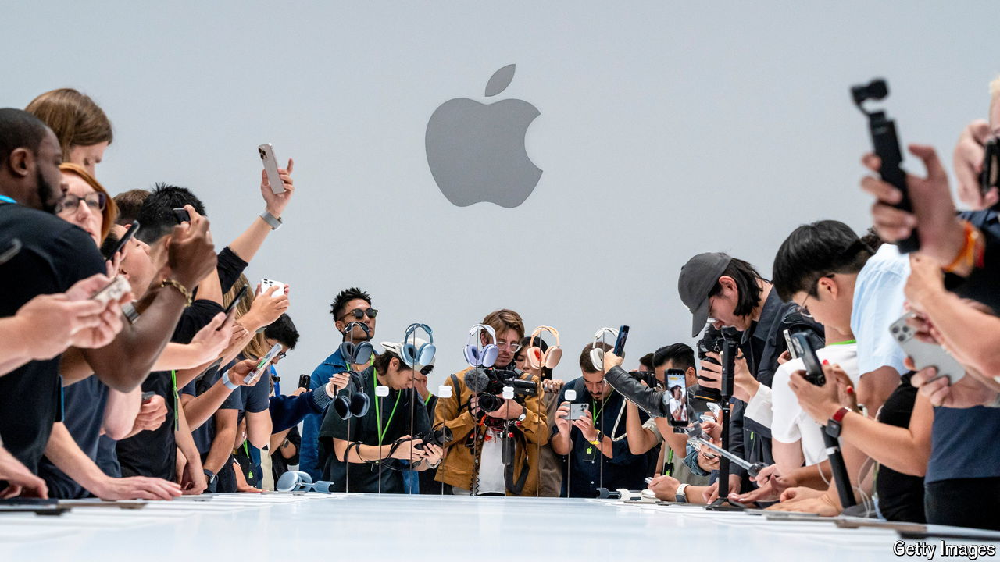

###### Not edgy enough

# AI will not fix Apple’s sluggish iPhone sales any time soon 

##### The technology is not yet ready for prime time on phones or other devices 

 

> Sep 10th 2024 

Bling is in the air. On September 9th Apple released its latest iPhone 16 series at an event called “It’s Glowtime”. The name referred to the sheen around Siri, its souped-up voice assistant. But it was just as appropriate for the new colour of its snazziest iPhone 16 Pro model: “desert titanium”—in other words, gold.

