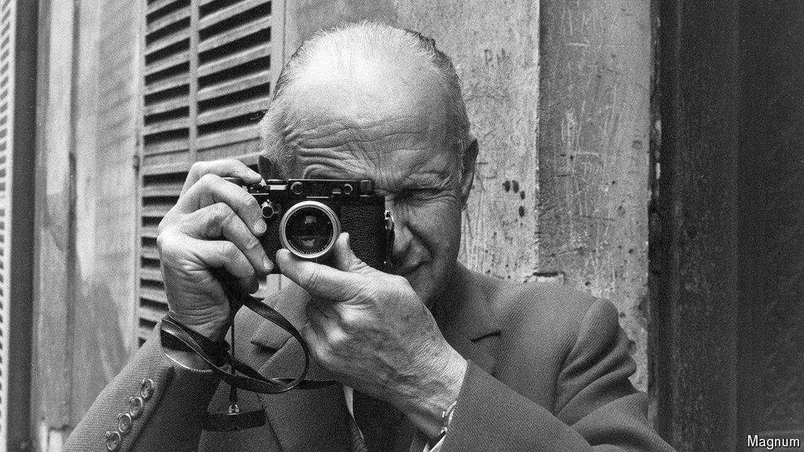

###### Snapped up

# Demand for high-end cameras is soaring 

##### The ubiquity of smartphones has helped 

 

> Sep 12th 2024 

Buying a Leica feels like buying a piece of art. Made in Germany, the cameras are sold in the swankiest neighbourhoods, sometimes in shops which double as galleries. The current models pack the latest imaging technology into sleek all-metal bodies. For decades they have been the chosen cameras of masters of photography such as Henri Cartier-Bresson (pictured) and Annie Leibovitz. Their price is extravagant. Leica’s latest compact model, the Q3, costs around $6,000 (an accompanying thumb rest is available for an extra $245). Opt for a flagship M-series camera with a couple of lenses and the bill can easily run into five figures. 

