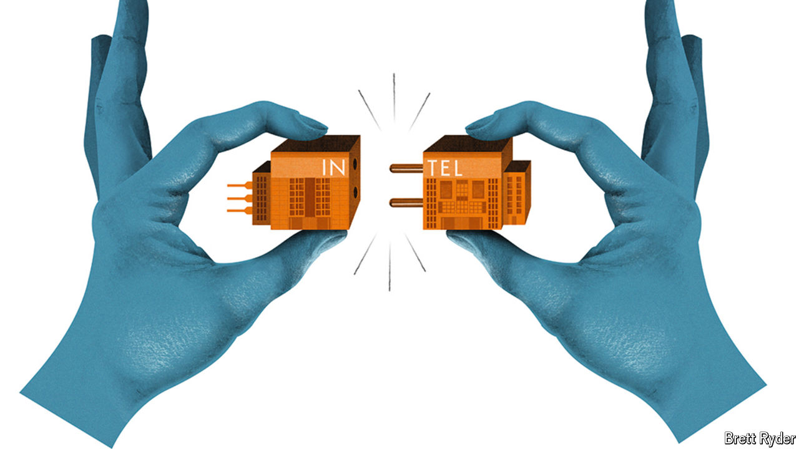

###### Schumpeter

# Intel is on life support. Can anything save it? 

##### Only drastic action can revive America’s chipmaking champion 

 

> Sep 12th 2024 

SINCE ITS founding in 1968 Intel has been synonymous with shrinkage. In its first four decades this was high praise. Every two years or so the American chip pioneer came out with new transistors half the size of earlier ones, a regularity that came to be known as Moore’s law, after one of the company’s founders. Twice as many chips thus fit onto roughly the same silicon wafer—and could be sold profitably for roughly the same price. That allowed Intel to corner the market for memory chips and then, when “memories” became commoditised in the 1980s, for the microprocessors which powered the subsequent PC revolution.

