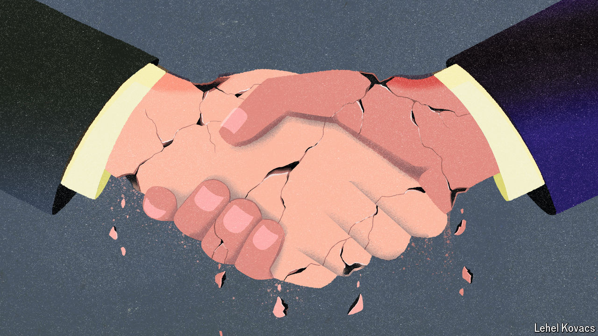

###### Mergers and inquisitions

# Is the era of the mega-deal over? 

##### Nippon’s acquisition of US Steel is not the only mega-merger falling apart 

 

> Sep 8th 2024 

The most important takeover battle in years is approaching a climax. While  at the start of the month Kamala Harris, the Democratic presidential nominee, said that US Steel should be , echoing a sentiment expressed earlier in the year by both President Joe Biden and Donald Trump, her Republican rival. The speech provoked the steelmaker—which had agreed to a takeover by Nippon Steel, a Japanese rival, for $15bn—to shoot back. Not only were workers rallying in support of the deal, it said, but the firm would consider lay-offs and moving its headquarters from the city should the takeover fall apart. Mr Biden is expected to block the deal imminently, ending a pantomime that has busied lawyers, bankers and lobbyists all year. US Steel’s share price has plunged (see chart 1).

