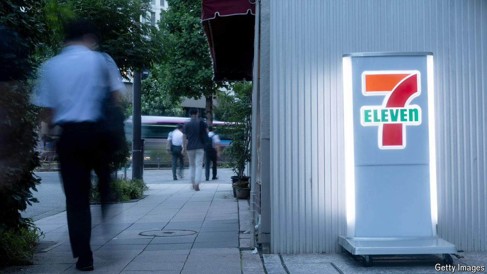

###### Job half done

# Japan’s sleepy companies still need more reform 

##### The country’s corporate-governance crusade has a long way to go 

 

> Sep 9th 2024 

REACTING to a takeover offer is a delicate moment for any company board. For the leadership of Seven &amp; i, the Japanese owner of 7-Eleven, a convenience-store chain, the burden of responsibility is even greater. Its response to what could become the largest ever foreign acquisition of a Japanese firm represents a pivotal moment in the country’s corporate-governance revolution.

