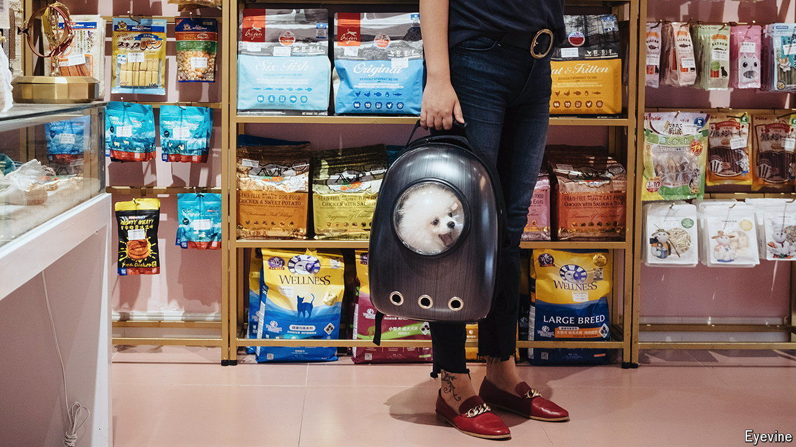

###### Raining cats and dogs

# People are splurging like never before on their pets 

##### Would you buy your furry companion a cologne? 

 

> Sep 12th 2024 

Among the products of Dog by Dr Lisa, an Australian pet-care brand, you will find a cleanser for sensitive skin, a soothing balm and a cologne. All are free of genetically modified ingredients—and vegan, which dogs are not, at least by choice. Still, canines craving meat need not eat like animals: Butternut Box, a maker of fresh pet food taste-tested by humans, can offer your furry friend a low-fat chicken dish with peas, lentils and “a whiff of sage”. It is the most popular meal it offers.

