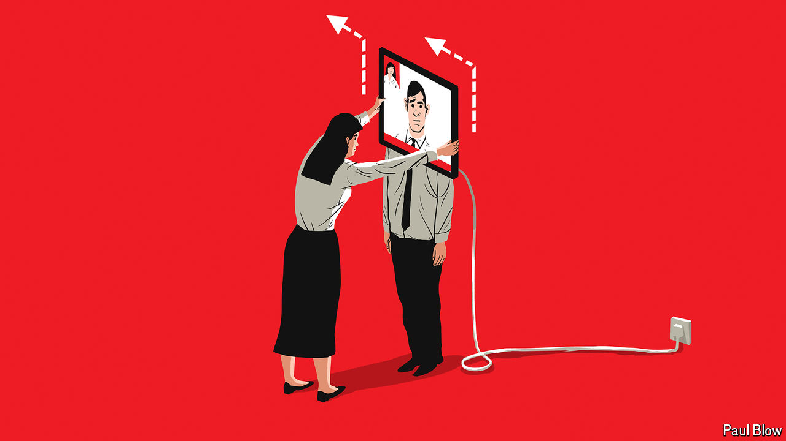

###### Bartleby

# Physical proximity has big effects in the workplace 

##### It needs to be managed wisely 

 

> Sep 12th 2024 

Seeing people in person matters. Information pours off them: not just what they say but how they say it and whether they listen. Relationships form more naturally. It’s much harder to look a person straight in the pixels.

