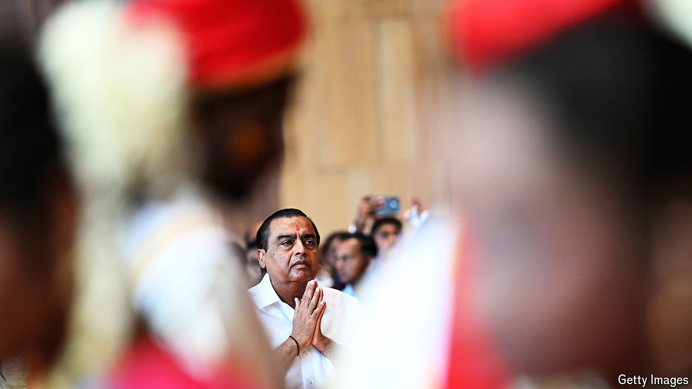

###### The ties that bind

# Why family empires dominate business in India 

##### Their grip on the economy may be starting to weaken—slowly 

 

> Sep 12th 2024 

For many years the hottest event in Indian capitalism was the annual general meeting of Reliance Industries. Thousands of attendees, from rickshaw drivers to day labourers, would pile into the Cooperage Football Stadium in Mumbai for a glimpse of Dhirubhai Ambani, the company’s charismatic founder.

