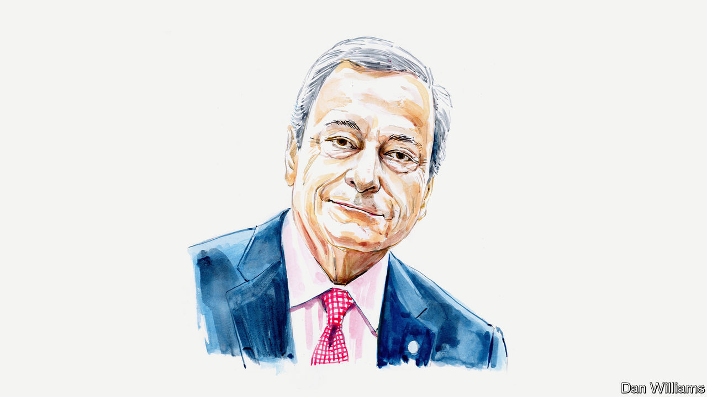

###### Euro-vision

# Mario Draghi outlines his plan to make Europe more competitive 

##### The continent needs investment on a par with the Marshall Plan and a lot more innovation, says the former central banker 

 

> Sep 9th 2024 

GROWTH IN EUROPE has been slowing for decades. Across different measures, a wide gap in GDP has opened up between the European Union and America. Europe’s households have paid the price in forgone living standards. On a per-person basis, real disposable income has grown almost twice as much in America as in the EU since 2000.

