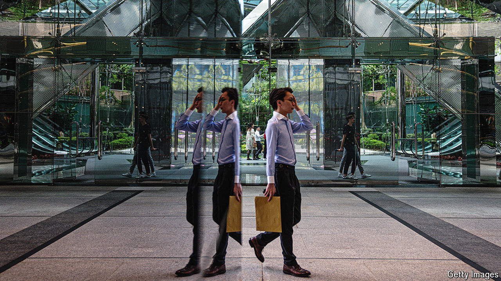

###### Stability, now what?

# Can Xi Jinping take Hong Kong “from stability to prosperity”? 

##### A fixation on security may cost the city in the long term 

 

> Sep 12th 2024 

“FROM CHAOS to order, from stability to prosperity.” That is Xi Jinping’s goal for Hong Kong. Ever since pro-democracy protests swept the city in 2019, China’s ruler has tried to reimpose control. In many ways he has succeeded. Today Hong Kong is less tumultuous than it was back then. The covid-19 pandemic, which saw the city close itself to the world, helped to calm things down. So have two draconian national-security laws, one imposed on the city by the central government in 2020 and another adopted by the local legislature this year. But the measures that have brought order, by striking fear into liberals, risk costing Hong Kong its prosperity by making it a less pleasant and predictable place to live and do business.

