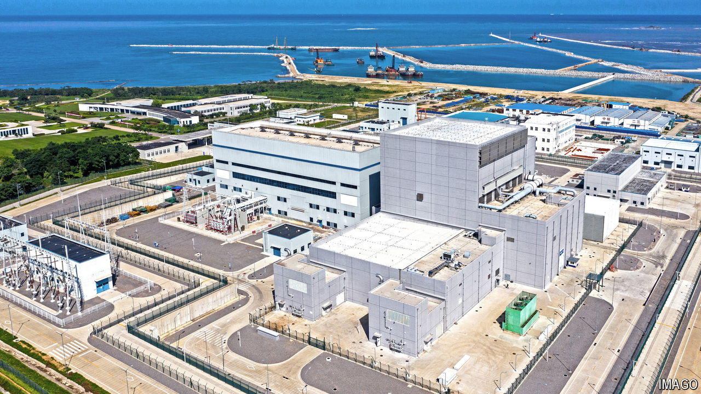

###### Leading the way

# China is beating America in the nuclear-energy race 

##### They have pioneered a new generation of reactor 

 

> Sep 12th 2024 

LAST YEAR engineers at China’s Shidaowan nuclear power plant turned off the pumps pushing coolant around the reactor core. Then they waited. At a typical power plant, this would have been dangerous. Nuclear reactions create lots of heat, which is normally transferred by a coolant and then converted into electricity. With the pumps off, the nuclear fuel might have continued to heat up until it liquefied and damaged the reactor. Such “meltdowns” can release radiation. That is what happened in 2011 at the Fukushima Dai-ichi nuclear plant in Japan after a tsunami damaged its cooling systems. 

