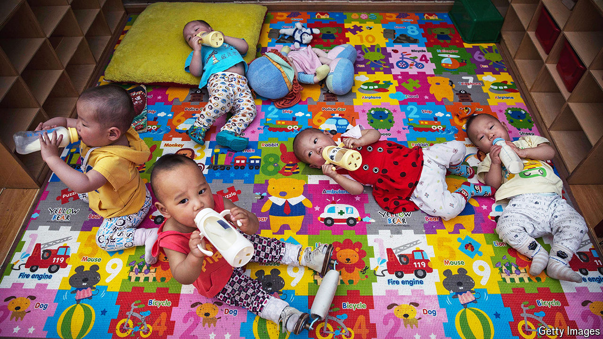

###### We’re keeping them

# Why China banned international adoptions 

##### Much has changed since the programme was started 

 

> Sep 12th 2024 

The announcement came at a routine press briefing on September 5th. Mao Ning, a foreign-ministry spokesperson, said China was grateful for the “desire and love” of the foreign families who wanted to adopt Chinese children. But, she added, China would no longer allow the practice. Exceptions would be made for foreigners adopting stepchildren and children of blood relatives in China. For everyone else the new policy would take effect immediately, meaning even adoptions already in progress would be halted.

