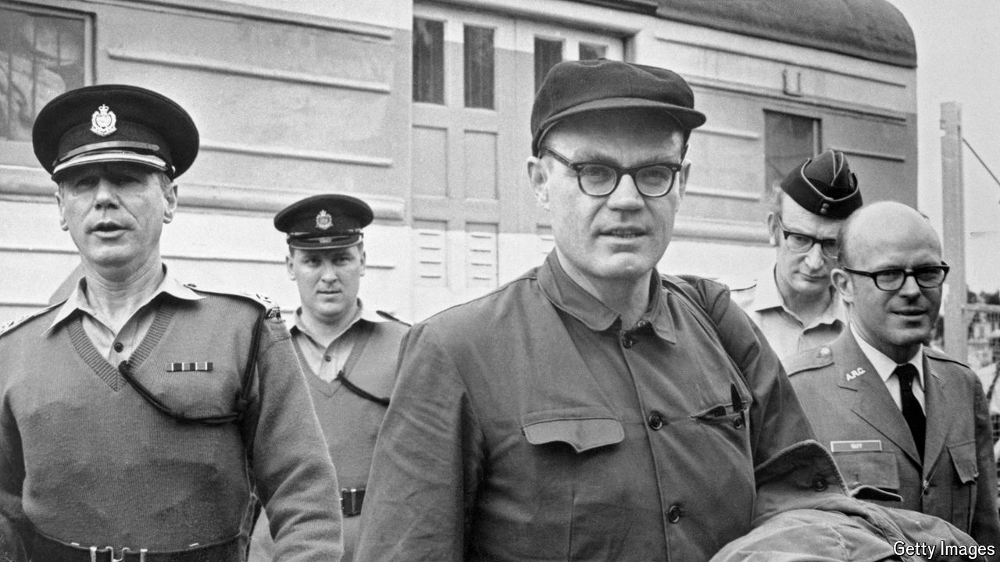

###### The CIA’s Rip van Winkle

# The riveting story of the longest-held American prisoner-of-war 

##### Jack Downey, a CIA agent held in China for two decades, offers a unique lens on prisoner swaps 

 

> Sep 12th 2024 

By Barry Werth. 

