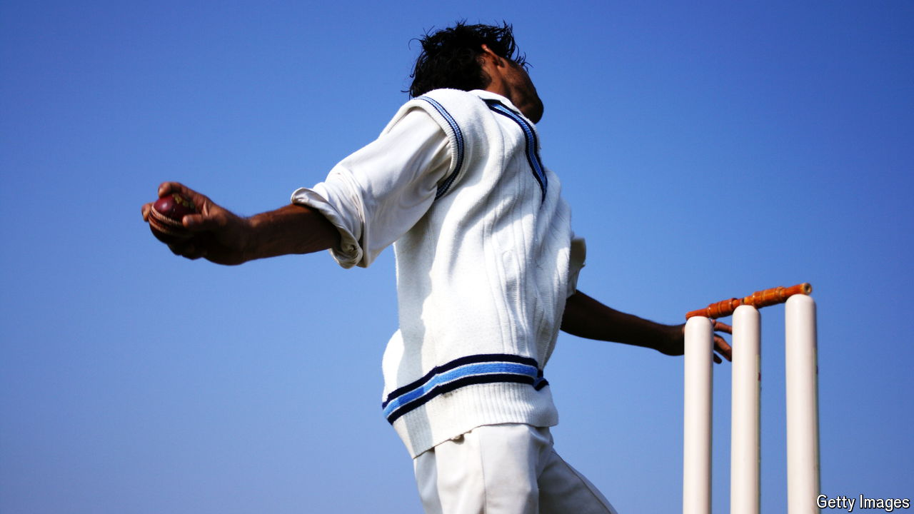

###### No ball

# A northern Italian town bans cricket 

##### Politically opportunistic xenophobia at work 

 

> Sep 12th 2024 

Cricket, you might think, is among the more benign legacies of British imperialism—a sport that unites blazer-wearing English toffs and players who first applied bat to ball in the slums of Kingston or Kolkata. But in Monfalcone, a town in north-eastern Italy, cricket has become a political football. (Sorry.)

