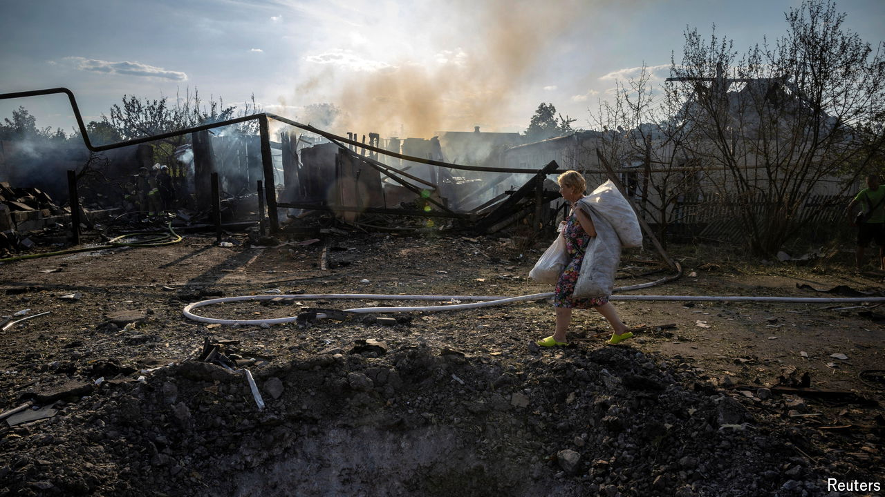

###### A bloody trade

# Danger in Donbas as Ukraine’s front line falters 

##### Russian fighters are trying to encircle the defenders 

 

> Sep 8th 2024 

IF YOU IMAGINE that the front lines in Donbas are well-defined, you should think again. Oleksandr, an officer with Ukraine’s 79th brigade, watches the battlefield near the frontline town of Kurakhove on control-room screens every day. The Russians are mostly in front of Ukrainian positions, he says, but sometimes cause havoc kilometres behind them. For the wretched pairs of soldiers in scattered positions at the edge of what he calls the kill zone, it is more often than not a one-way mission. As many as 18 Russian soldiers might die to dislodge two worn, hungry Ukrainians. But eventually, they will. “We are exchanging lives and territory for time and the opponent’s resources.” 

