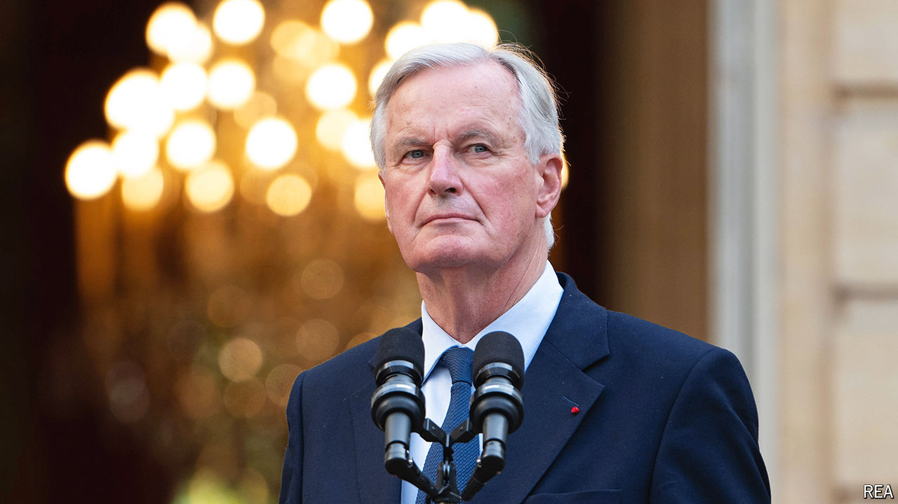

###### French politics

# Michel Barnier’s burden 

##### France has found a prime minister, but is still seeking a government 

 

> Sep 12th 2024 

Found: a new prime minister. Wanted: a new government. President Emmanuel Macron’s appointment of Michel Barnier as France’s new prime minister on September 5th, after a two-month search that followed inconclusive parliamentary elections in July, ended one painful political quest. A veteran conservative from the Republicans party and the European Union’s former Brexit negotiator, Mr Barnier is a pro-European Gaullist with old-school manners and a reputation for consensus-seeking. His selection has reassured investors; 52% of the French approve. But he now has his work cut out trying to forge a government with any chance of survival.

