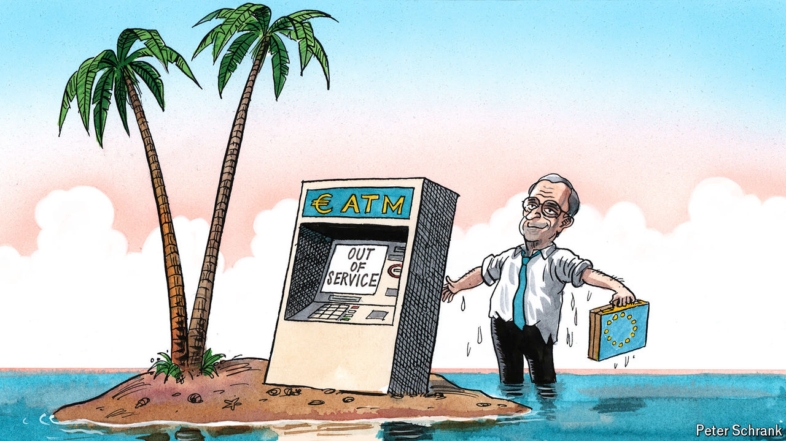

###### Charlemagne

# Nice ideas, Mr Draghi—now who will pay for them? 

##### From “whatever it takes” to “whatever the cost” 

 

> Sep 12th 2024 

An old joke haunts economists. A chemist, a physicist and an economist are stranded on a desert island with a tin of beans but no implement to open it. The chemist suggests corroding the container with sea water, but concludes it would take years. The physicist proposes a method to prise the tin open that turns out to be equally impractical. The economist is delighted that only she has the right answer: “Assume a tin-opener.”

