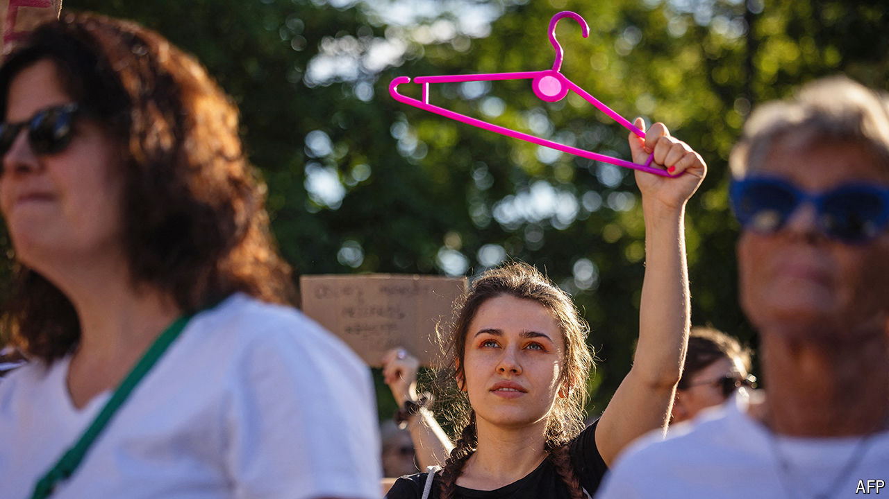

###### Choice v life

# Poland’s ruling coalition divides over women’s rights 

##### Donald Tusk has failed to keep his promises on abortion laws 

 

> Sep 12th 2024 

A FLAT IN Warsaw will soon become Poland’s first abortion clinic. The interior, designed like a teenage girl’s bedroom, reflects the reality of abortions in a country where they are in effect illegal: most of them happen at home, the woman unassisted and alone. Abortion Dream Team, the charity behind the project, says that every day around 130 girls and women contact it for help in ending their pregnancies. The clinic, which will operate in a legal grey zone, will give them space to do so—with a comfy sofa and films to distract them while they take abortion pills. 

