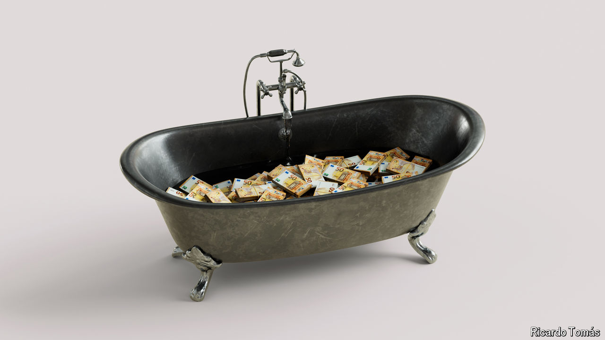

###### Dirty sponges

# Squeaky-clean Europe is more corrupt than you think 

##### Scandals and scams are rife. The EU’s clean-up isn’t working fast enough 

 

> Sep 12th 2024 

“IT WAS RETRO style,” laughs Ruta Kaziliunaite, the co-ordinator of Lithuania’s Special Investigation Service (STT), the country’s anti-corruption police. Last November the former leader of the Liberal Movement party was convicted of taking bribes from an executive at MG Baltic, a trading and real-estate conglomerate. It was not a matter of hidden transfers to shell companies, but of old-fashioned wads of cash: the STT found €242,000 ($269,000) stashed in the MP’s house and car. (Both men are appealing.)

