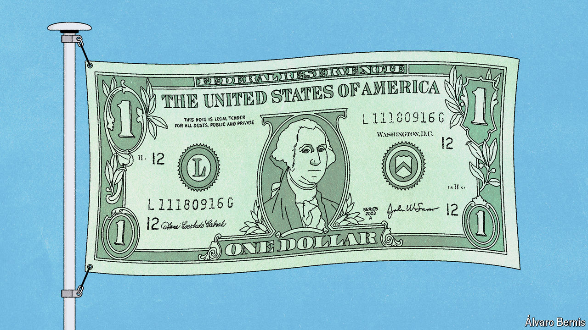

###### Free exchange

# An American sovereign-wealth fund is a risky idea 

##### Donald Trump’s latest proposal has worryingly broad support 

 

> Sep 12th 2024 

Not long ago America’s main concern with sovereign-wealth funds was how to regulate these large pools of money controlled by foreign governments. Now, seemingly overnight, the hot new idea in Washington, DC, is that America should join the club. It is easy to understand the allure. A well-managed SWF can, in theory, let the government direct more cash towards its strategic aims, without—if returns are strong—the need to raise taxes. In practice, achieving this balance is difficult. In America a SWF looks like a risky solution to a problem that does not truly exist.

