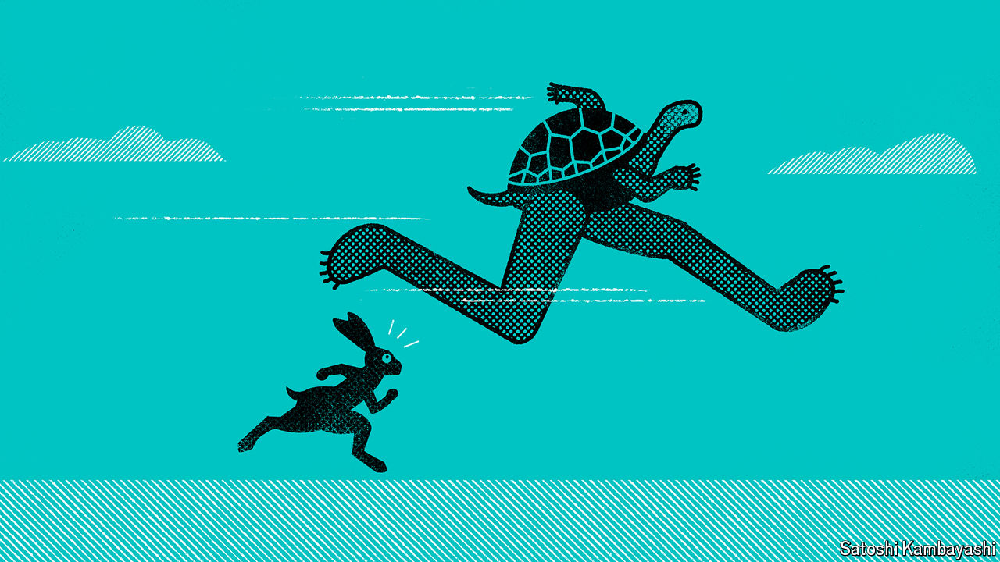

###### Buttonwood

# Can bonds keep beating stocks? 

##### After a terrible couple of months for shareholders, lenders are feeling smug 

 

> Sep 12th 2024 

Diversification, goes an adage attributed to the late Harry Markowitz, is the only free lunch in investing. The idea later helped him win a Nobel prize for economics. Markowitz’s genius was to realise that a portfolio spread across lots of assets could have the same potential for returns as a more concentrated one, but with less scope for losses. In other words, diversification allows investors to take less risk without sacrificing reward—quite some freebie.

