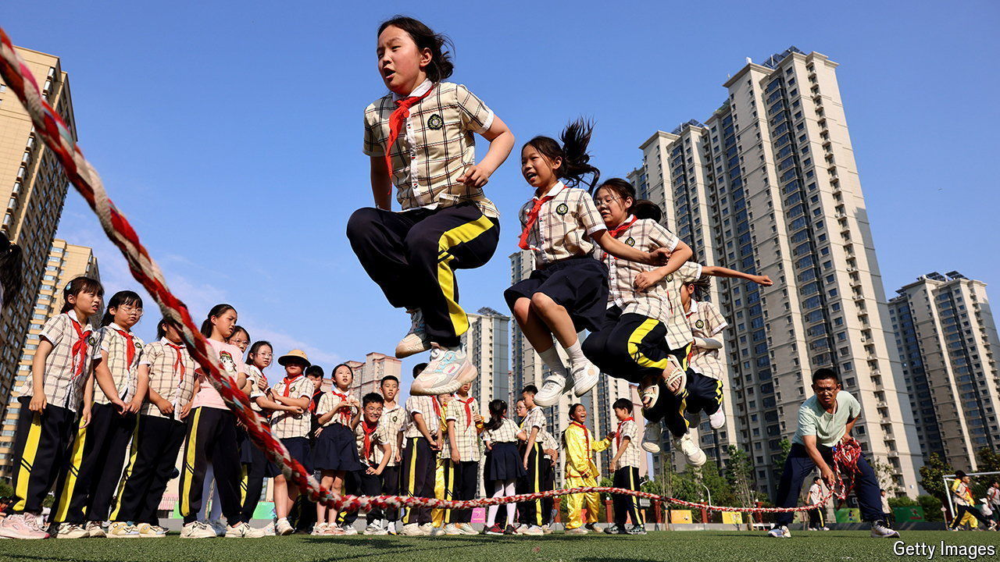

###### Xi, the generous

# China’s government is surprisingly redistributive 

##### That is despite a stingy tax-and-transfer system 

 

> Sep 12th 2024 

When China’s ruler, Xi Jinping, began calling for “common prosperity” in 2021, he made investors nervous. The stated goal was to reduce inequality. But the term became wrapped up with something edgier: a morale-destroying campaign to browbeat billionaires into displays of charity, tighten regulations on big tech firms and curb what Mr Xi called the “disorderly expansion of capital”.

