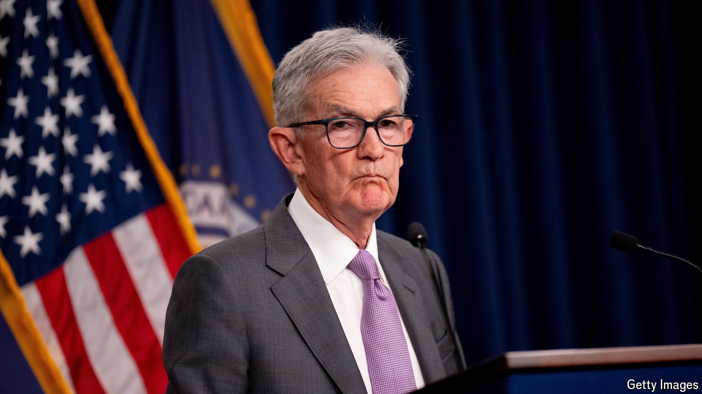

###### Delayed reaction

# Strangely, America’s companies will soon face higher interest rates 

##### Even though the Federal Reserve is about to loosen monetary policy 

 

> Sep 11th 2024 

Between early 2022 and mid-2023 the Federal Reserve tightened monetary policy at the fastest pace since the early 1980s, lifting America’s policy interest rate from 0-0.25% to 5.25-5%. When the central bank’s policymakers next meet on September 17th and 18th, they will almost certainly start cutting rates. Investors even wonder whether they will begin with a 0.5-percentage-point reduction, in response to cooler-than-expected economic data.

