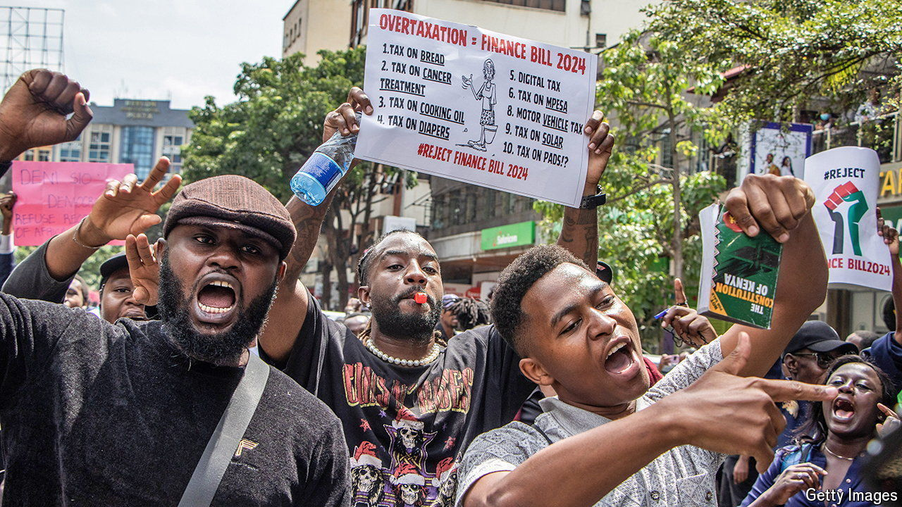

###### Long, hot summer

# The IMF has a protest problem 

##### Does it give up—or insist on painful reforms? 

 

> Sep 12th 2024 

It has been a tumultuous few months for the International Monetary Fund’s borrowers. In June protests brought thousands onto the streets in Kenya after William Ruto, the president, laid out the spending cuts required to convince the IMF to disburse the latest instalment of the country’s $3bn bail-out. Two months later, Sheikh Hasina, prime minister of Bangladesh, which also has a programme with the fund, was ousted when reforms to the country’s bureaucracy sparked riots. 

