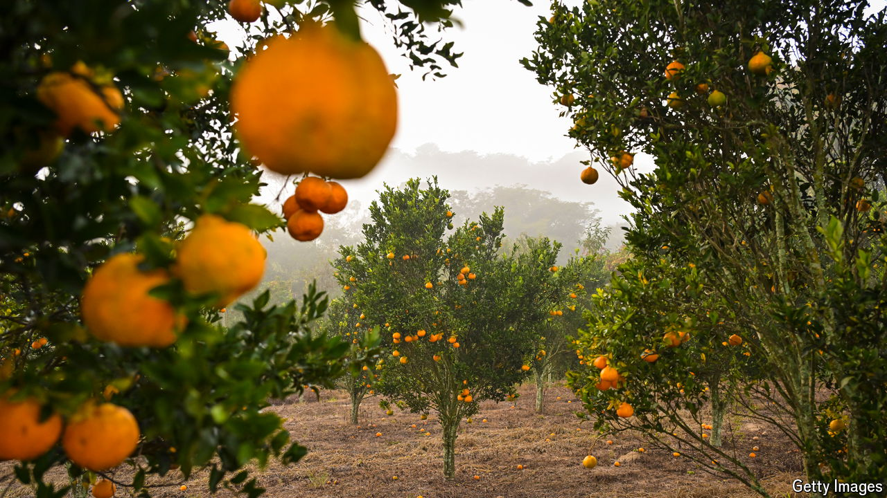

###### The big squeeze

# Why orange juice has never been more expensive 

##### Pity those who rely on the breakfast staple 

 

> Sep 12th 2024 

Mimosas have a simple recipe: one part champagne, one part orange juice. Soon, though, the tipple may be even less affordable—and not because sparkling wine is ever more expensive. Concentrate orange-juice futures in New York, which soft-drink producers use to hedge against price swings, have quadrupled since late 2021. They hit an intraday high of $5.80 a pound on September 9th, their fifth record in a week.

