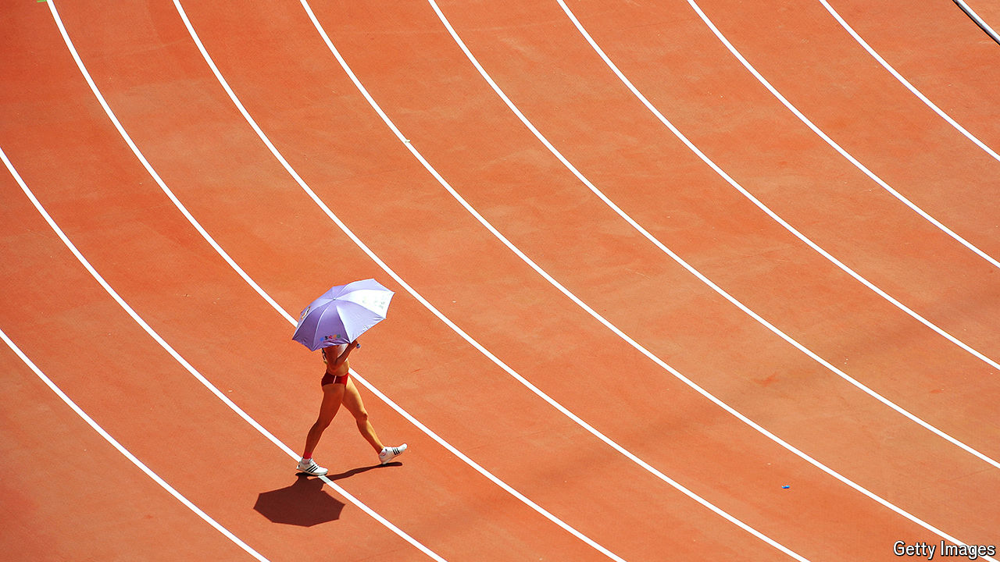

###### The toil, tears and sweat of competition

# Sport is getting hotter, harder and deadlier 

##### As players vomit and boil, even John McEnroe reckons “it is not humane” 

 

> Sep 12th 2024 

“One player gonna die,” complained Daniil Medvedev in the middle of a match on the hottest day of the US Open in New York last year, as the temperature soared to 34°C. “It’s been brutal…it ruins everything.” Similar temperatures—combined with higher humidity—sometimes made conditions even more punishing at this year’s tournament that ended on September 8th. Players struggled and vomited; in the breaks they packed bags of ice around their necks and heads, or stuck hoses blowing cold air down their shirts in an effort to cool down. Sweltering in the steeply sloping cheaper seats was the largest crowd ever: in all, some 1m spectators attended the competition, fulfilling a goal the organisers had set in 2019. 

