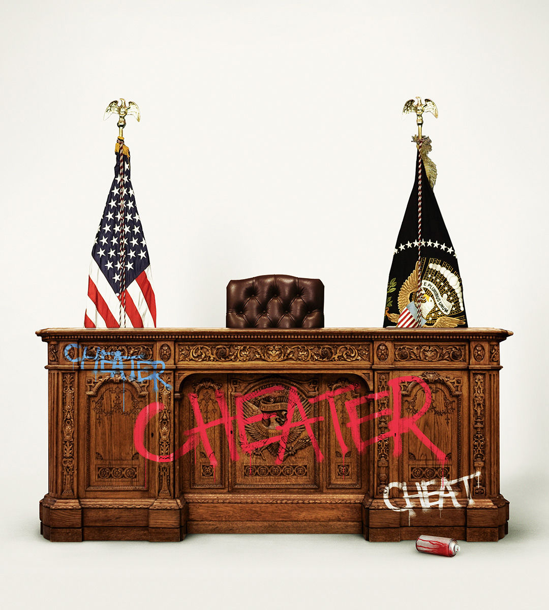

###### How ugly will it get?

# America’s election is mired in conflict 

##### Donald Trump’s conspiracy machine is already gearing up for election night 

 

> Sep 12th 2024 

Even without Donald Trump on the ballot, American elections tend to create conflict. America is the only proper presidential democracy in which the person who wins the most votes does not necessarily win power. The two-month gap between voting and election certification in Congress is the most drawn-out anywhere. Complexity invites legal challenges, which add to the complexity. For all those reasons, American elections demand patience and trust. Unfortunately, the country comes joint last among the G7 on trust in the judiciary and dead last on belief that its elections are honest.

