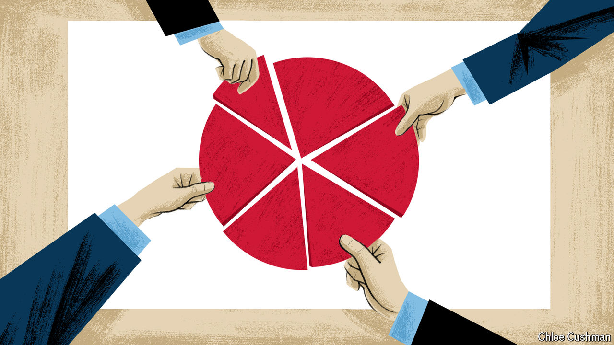

###### Corporate crusade

# How to finish Japan’s business revolution 

##### Tokyo-listed companies have become more friendly to shareholders, but the job is only half-done 

 

> Sep 12th 2024 

Shareholder capitalism has had a difficult decade. Large companies around the world have been loaded with social, environmental and national-security goals that are outside their usual profit-making remit, often by governments. Corporate Japan, by contrast, has become far friendlier to shareholders of listed firms. Governance reforms that began after Abe Shinzo became prime minister in 2012 have chipped away at stuffy and value-destroying practices long associated with Japan Inc. The result has been a burst of confidence in Japan’s hitherto-stagnant economy.

