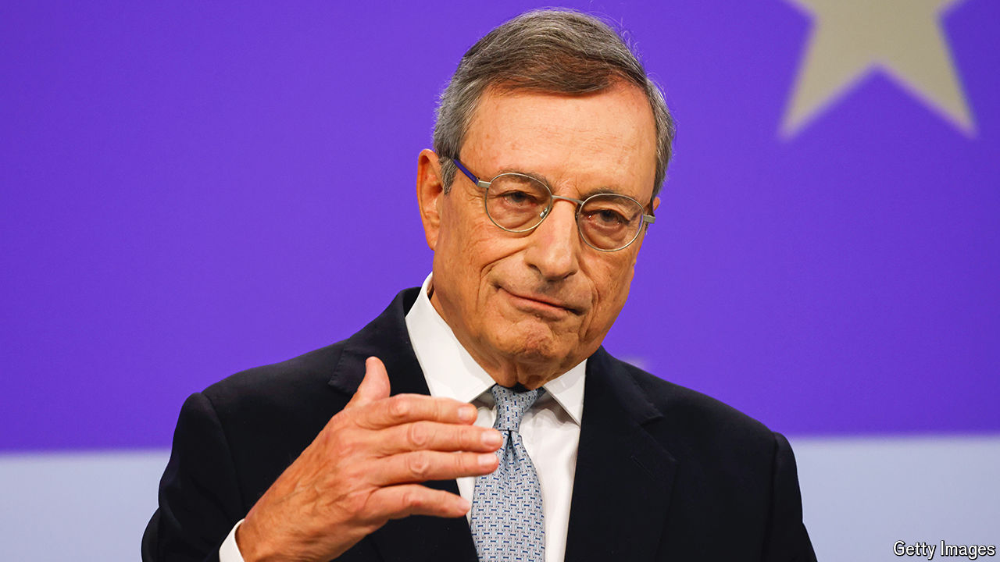

###### Mixed message

# Mario Draghi’s best ideas are those Europe finds least comfortable 

##### The danger is that it picks the easy ones 

 

> Sep 10th 2024 

Adam Smith thought that achieving spectacular economic growth required little more than “peace, easy taxes and a tolerable administration of justice”. Don’t tell Mario Draghi, who has just penned almost 400 pages on , meaning economic growth. This is the second technocratic door-stopper commissioned by the European Union as it tries to bring stagnation to an end. As Mr Draghi observes in , an ageing population means that, if productivity growth does not rise, Europe’s economy will be no bigger in 2050 than it is today.

