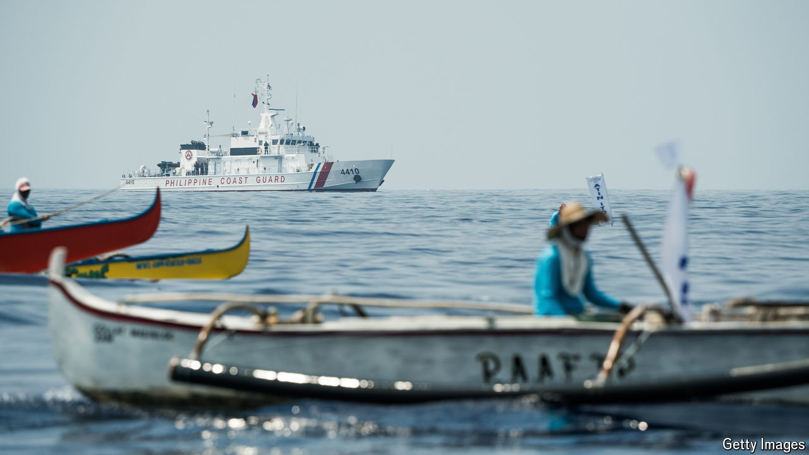

###### The dangers of rock claiming

# More storms are brewing in the South China Sea 

##### A dangerous new stage in the conflict is beginning 

 

> Sep 12th 2024 

Eight years ago China lost a legal battle over its fantastical territorial claims in the South China Sea. An international tribunal ruled they had no basis. China responded by continuing to occupy and fortify reefs and rocks and sometimes preventing fishing and energy development by other countries. Now the confrontation is heating up as Vietnam, the Philippines and Malaysia challenge China’s claims and aggression in different ways. Broadly speaking, this pushback is welcome. However, it should not be reckless. America should ensure that its ally, the Philippines, treads carefully.

