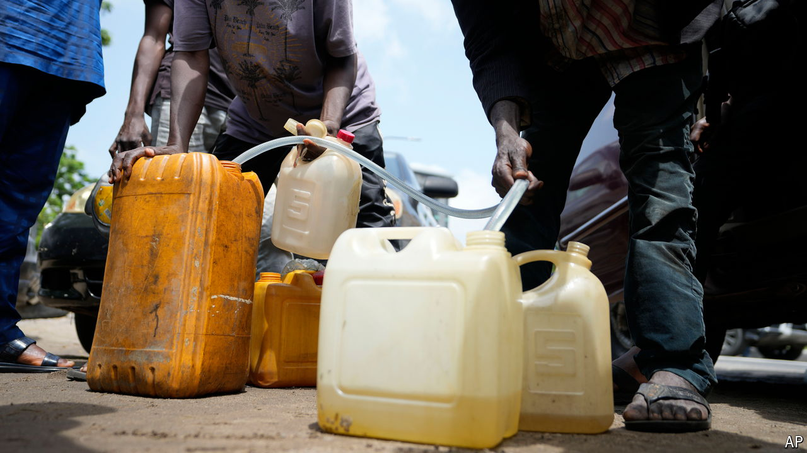

###### Subsidise people, not petrol

# Nigeria’s catastrophic fuel crisis has a straightforward solution 

##### How to scrap a popular yet ruinous subsidy 

 

> Sep 11th 2024 

Wise petrostates seek to turn oil revenues into human capital. By investing in better clinics, schools and other public services, they nurture healthy, well-educated citizens who will thrive long after the oil runs dry. Nigeria offers its people cheap petrol instead. Nearly half the government’s oil revenues are wasted on petrol subsidies—2.3% of GDP, or four times the health budget. It should scrap this subsidy, a hard step that could be made politically easier by the start of petrol production last week at  owned by Aliko Dangote, Nigeria’s richest man.

